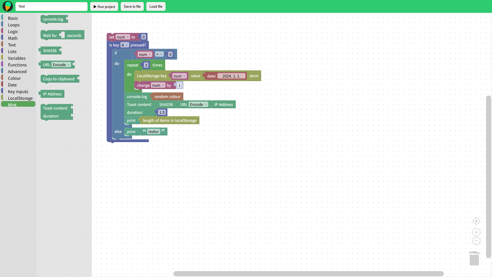

# MintCoding


> Blockly 기반의 블록코딩 에디터입니다. 드래그 앤 드롭으로 코드를 조립해 웹 프론트엔드 코드를 생성해보세요.

-----

## 프로젝트 구조

```
MintCoding/
├── css/
│   ├── editor.css
│   └── style.css
├── img/
│   ├── MintCoding_img.png
│   ├── entry.svg
│   ├── github.svg
│   └── logo.svg
├── js/
│   ├── customBlocks/
│   │   ├── date/
│   │   │   ├── date.js
│   │   │   └── generator.js
│   │   ├── keydown/
│   │   │   ├── keydown.js
│   │   │   └── generator.js
│   │   └── mint/
│   │       ├── mint.js
│   │       └── generator.js
│   ├── app.js
│   ├── functions_for_blocks.js
│   ├── lang.js
│   └── lang_newProject.js
├── pages/
│   └── newProject.html
├── Example.mint
├── CONTRIBUTING.md
├── SECURITY.md
├── README.md
├── .gitattributes
├── LICENSE
└── index.html
```

-----

## 커스텀 블록

|블록 이름          |설명                 |
|---------------|-------------------|
|민트 블록          |MintCoding 전용 핵심 블록|
|날짜 블록          |날짜 및 시간 관련 블록      |
|LocalStorage 블록|브라우저 로컬 스토리지 제어 블록 |
|키 입력 블록        |키보드 이벤트 처리 블록      |


> 커스텀 블록은 계속 추가될 예정입니다.

-----

## 미리보기



-----

## ⚠️ 참고

`.mint` 파일은 웹 프론트엔드 언어인 [Mint-lang](https://www.mint-lang.com/)의 확장자와 **무관합니다.** MintCoding에서 프로젝트를 저장할 때 사용하는 자체 포맷입니다.

-----

## 라이선스

이 프로젝트는 [MIT License](LICENSE) 하에 배포됩니다.